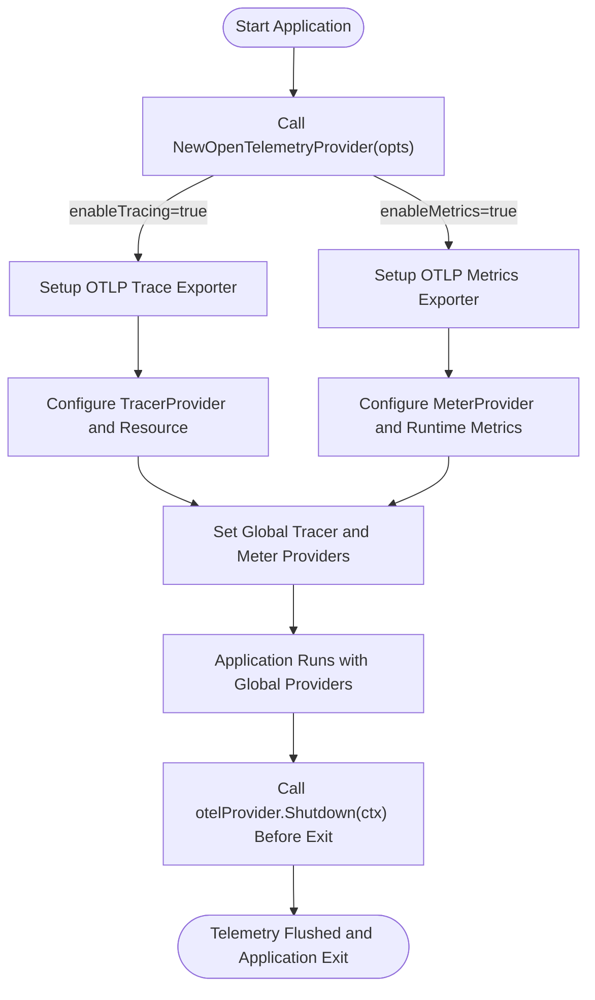

# Set Up the Default OpenTelemetry Provider

This guide walks you through configuring the built-in OpenTelemetry provider for GORM. It focuses on how to initialize the default provider, explains environment variable usage to manage configuration across deployments, and helps you get tracing and metrics up and running smoothly with minimal code.

---

## 1. Overview

### What This Guide Helps You Accomplish
This document will guide you in setting up the default OpenTelemetry provider included with the GORM OpenTelemetry plugin. You'll learn how to enable and configure tracing and metrics collection, manage exporter endpoints, and leverage environment variables to tune your setup without code changes.

### Prerequisites
- Go environment setup with GORM and the OpenTelemetry plugin installed.
- Basic familiarity with Go applications and dependency management.
- An OpenTelemetry-compatible backend or collector (e.g., Jaeger, Prometheus) if you want to export telemetry data.

### Expected Outcome
By following this guide, you will have a working OpenTelemetry provider configured in your GORM application that collects and exports tracing and/or metrics data, configurable via environment variables or programmatic options.

### Time Estimate
Approximately 10-20 minutes for a basic setup and testing.

### Difficulty Level
Beginner to Intermediate.

---

## 2. Understanding the Default Provider

The default OpenTelemetry provider is designed to simplify telemetry integration for GORM users by providing:

- Automatic initialization of OTLP exporters for trace and metric data.
- Seamless integration with the OpenTelemetry SDK tracer and meter providers.
- Support for environment-based configuration including endpoints, headers, and security.
- Flexible enabling or disabling of tracing and metrics independently.
- Built-in resource attributes like service name, host, and deployment environment.

You don’t need to manually create or configure many components; the default provider sets sensible defaults and integrates with OpenTelemetry’s common conventions out-of-the-box.

---

## 3. Step-by-Step Setup Instructions

### Step 1: Import the Provider Package
Make sure your code imports the `provider` package from the plugin to access the default provider functionality.

```go
import "gorm.io/plugin/opentelemetry/provider"
```

### Step 2: Initialize the Default Provider
Call `NewOpenTelemetryProvider()` to initialize the provider with default options or pass customized options as needed.

```go
import (
	"context"
	"gorm.io/plugin/opentelemetry/provider"
)

func setupOTELProvider() provider.OtelProvider {
	ctx := context.Background()
	return provider.NewOpenTelemetryProvider()
}
```

- This call initializes exporters and configures tracing and metrics according to environment variables and default settings.
- If no telemetry features are enabled via options, it returns nil.

### Step 3: Customize Configuration Options (Optional)
You can customize the provider by passing options such as enabling/disabling tracing or metrics, setting the export endpoint, adding headers, or overriding resource attributes.

Example:

```go
import (
	"context"
	"gorm.io/plugin/opentelemetry/provider"
	"go.opentelemetry.io/otel/attribute"
)

func setupCustomProvider() provider.OtelProvider {
	ctx := context.Background()
	return provider.NewOpenTelemetryProvider(
		provider.WithEnableTracing(true),
		provider.WithEnableMetrics(false),
		provider.WithExportEndpoint("otel-collector.mydomain.com:4317"),
		provider.WithHeaders(map[string]string{"Authorization": "Bearer token"}),
		provider.WithResourceAttributes([]attribute.KeyValue{
			attribute.String("service.version", "1.2.3"),
		}),
	)
}
```

### Step 4: Use the Provider within Your Application
Once configured, the provider automatically registers the OpenTelemetry tracer and meter providers globally, so you can use OpenTelemetry instrumentation (like the GORM OpenTelemetry tracing plugin) seamlessly.

### Step 5: Properly Shutdown Provider on Application Exit
To ensure a clean shutdown flushing all telemetry data, call the `Shutdown()` method on your provider, passing a context with a timeout.

```go
ctx, cancel := context.WithTimeout(context.Background(), 5*time.Second)
defer cancel()

provider := setupOTELProvider()

if provider != nil {
	if err := provider.Shutdown(ctx); err != nil {
		// Handle error
	}
}
```

---

## 4. Managing Configuration with Environment Variables

The provider supports environment variables to configure its behavior dynamically without code changes. Key environment variables that affect the default provider include:

| Environment Variable          | Purpose                            | Example                      |
|------------------------------|----------------------------------|------------------------------|
| `OTEL_EXPORTER_OTLP_ENDPOINT`| gRPC endpoint for OTLP exporter   | `localhost:4317`             |
| `OTEL_EXPORTER_OTLP_HEADERS` | Headers for authentication        | `Authorization=Bearer token` |
| `OTEL_EXPORTER_OTLP_INSECURE`| Disable TLS for gRPC connection   | `true`                      |
| `OTEL_SERVICE_NAME`          | Service name resource attribute   | `my-gorm-service`             |
| `OTEL_SERVICE_NAMESPACE`     | Service namespace attribute       | `backend`                     |
| `OTEL_DEPLOYMENT_ENVIRONMENT`| Deployment environment attribute  | `production`                  |

These variables align with OpenTelemetry Collector conventions and provide a standard way to adapt your telemetry export configuration per environment (dev, staging, production).

> Note: The provider automatically picks up these environment variables when creating resources and exporters.

---

## 5. Practical Example: Basic Provider Setup with Tracing Only

Below is a minimal example to initialize the default provider enabled for tracing only. It includes sample environment variable configuration.

```bash
export OTEL_EXPORTER_OTLP_ENDPOINT="localhost:4317"
export OTEL_SERVICE_NAME="my-gorm-service"
export OTEL_EXPORTER_OTLP_INSECURE=true
```

```go
package main

import (
	"context"
	"fmt"
	"time"

	"gorm.io/plugin/opentelemetry/provider"
	"gorm.io/plugin/opentelemetry/tracing"
	"gorm.io/driver/sqlite"
	"gorm.io/gorm"
)

func main() {
	ctx := context.Background()

	// Enable tracing only
	otelProvider := provider.NewOpenTelemetryProvider(
		provider.WithEnableTracing(true),
		provider.WithEnableMetrics(false),
	)
	defer otelProvider.Shutdown(ctx)

	// Open your GORM DB connection
	db, err := gorm.Open(sqlite.Open("file::memory:?cache=shared"), &gorm.Config{})
	if err != nil {
		panic(err)
	}

	// Use the tracing plugin
	if err := db.Use(tracing.NewPlugin(tracing.WithoutMetrics())); err != nil {
		panic(err)
	}

	// Use db with context to create trace spans automatically
	db = db.WithContext(ctx)

	// Example query
	var result int
	err = db.Raw("SELECT 42").Scan(&result).Error
	if err != nil {
		panic(err)
	}

	fmt.Println("Query Result:", result)

	// Give exporter some time to send data
	time.Sleep(2 * time.Second)
}
```

---

## 6. Best Practices and Tips

- **Use Environment Variables for Flexibility:** Adjust your exporter endpoints and security settings per environment without recompiling your application.
- **Manage Tracing and Metrics Separately:** Enable only what's necessary to avoid overhead in production.
- **Always Shutdown Provider Gracefully:** To avoid losing telemetry data, always call `Shutdown()` with a context deadline before your application exits.
- **Add Custom Resource Attributes:** Use options like `WithResourceAttributes` to provide additional context such as version, environment, or namespace.
- **Test OpenTelemetry Setup Locally:** Use tools like Jaeger (`jaegertracing/all-in-one`) or Prometheus to validate that your telemetry is correctly sent.

---

## 7. Troubleshooting Common Issues

<AccordionGroup title="Troubleshooting Default Provider Setup">
<Accordion title="Provider Fails to Initialize">
Ensure your OTLP endpoint is reachable and correct. Network misconfiguration or unreachable endpoints will cause the provider to fail with fatal logs.
</Accordion>
<Accordion title="Telemetry Data Does Not Appear in Backend">
- Verify environment variables like `OTEL_EXPORTER_OTLP_ENDPOINT` are set correctly.
- Confirm your telemetry backend (e.g., Jaeger collector) is running and accepting OTLP data.
- Check for TLS or connection security mismatches. Set `OTEL_EXPORTER_OTLP_INSECURE=true` if your backend is not using TLS.
</Accordion>
<Accordion title="Metrics Collection Not Working">
- Make sure to enable metrics explicitly: `WithEnableMetrics(true)`.
- Verify that runtime metrics collector started successfully.
- Check exposure endpoints and Prometheus configuration if using Prometheus exporter.
</Accordion>
<Accordion title="Application Panics on Provider Setup">
- Review log output for details on initialization failures.
- Double-check option parameters for validity.
- Test minimal configuration first, then add complexity.
</Accordion>
</AccordionGroup>

---

## 8. Next Steps

- Integrate the default provider setup with your full GORM OpenTelemetry instrumentation including tracing and logging.
- Explore configuring tracing without metrics via the [Configure Tracing Without Metrics](https://gorm.io/docs/guides/essential-workflows/configure-only-tracing) guide.
- Add structured logging setup using the Logrus integration for enhanced context correlation.
- Consider advanced resource configuration for multi-service environments.

---

## Appendix: Internal Provider Flow Overview



This flow illustrates your application's lifecycle concerning the default OpenTelemetry provider.

---

For more examples and detailed workflows, refer to the [GORM OpenTelemetry Plugin Examples](https://github.com/go-gorm/opentelemetry/tree/main/examples).


---

## References
- [OpenTelemetry Collector](https://opentelemetry.io/docs/collector/)
- [OTLP gRPC Exporter Spec](https://github.com/open-telemetry/opentelemetry-specification/blob/main/specification/protocol/exporter.md)
- [Jaeger All-In-One Docker Image](https://hub.docker.com/r/jaegertracing/all-in-one)
- [Prometheus Official Site](https://prometheus.io/)


---

This concludes the setup guide for the Default OpenTelemetry Provider in GORM.

---

## Related Documentation
- [Enable Tracing and Metrics Collection](https://gorm.io/docs/guides/essential-workflows/enable-tracing-metrics)
- [Configure Tracing Without Metrics](https://gorm.io/docs/guides/essential-workflows/configure-only-tracing)
- [Instrument GORM Logging with Logrus](https://gorm.io/docs/guides/essential-workflows/setup-logging)
- [High-Level Architecture](https://gorm.io/docs/overview/architecture-and-concepts/high-level-architecture)

---

Feel free to explore those guides for a deeper understanding and extended use cases.