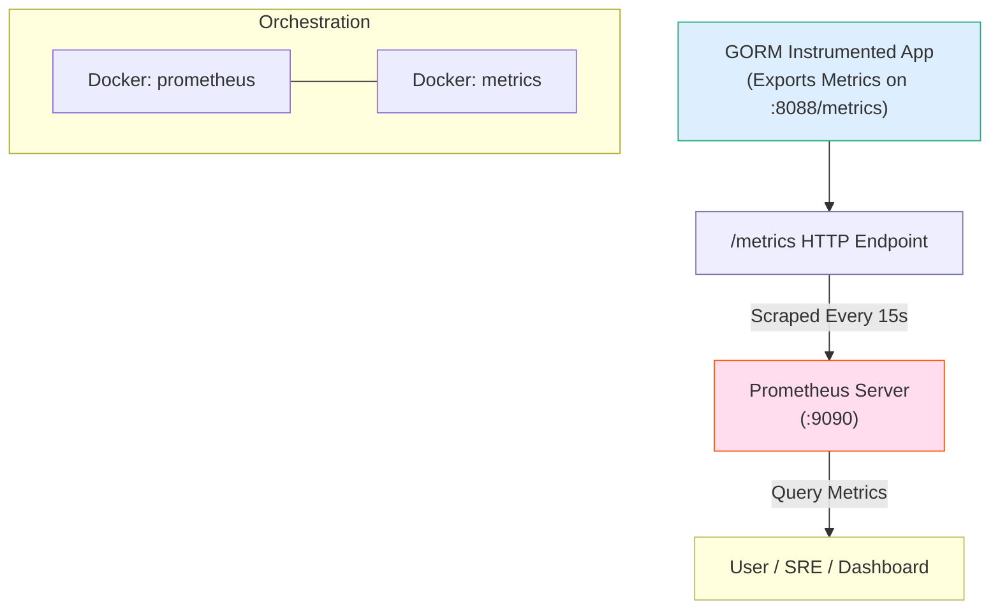

# Integrate with Prometheus Monitoring

This guide walks you through exporting GORM metrics to Prometheus, configuring Prometheus scraping, orchestrating services via Docker Compose, and interpreting collected GORM metrics to gain actionable insights about your database's performance and health.

---

## 1. Workflow Overview

### Task Description
You will configure your GORM-enabled Go application to export database metrics in Prometheus format. Then, set up Prometheus as a scraping target to collect and visualize these metrics efficiently.

### Prerequisites
- A Go application instrumented with the GORM OpenTelemetry plugin that supports metrics collection.
- Docker and Docker Compose installed locally.
- Basic familiarity with Prometheus concepts and Go.

### Expected Outcome
By completing this guide, you will have a running Prometheus instance scraping metrics exposed by your application, enabling real-time monitoring of database connection statistics and other important telemetry.

### Time Estimate
Approximately 20-30 minutes.

### Difficulty Level
Intermediate

---

## 2. Step-by-Step Instructions

### Step 1: Instrument Your GORM Application to Export Metrics

1.1 Integrate Prometheus exporter with OpenTelemetry metrics in your Go application.

1.2 Use the provided example code to expose metrics at `http://localhost:8088/metrics`.

```go
import (
	"net/http"
	"time"

	"github.com/prometheus/client_golang/prometheus/promhttp"
	"go.opentelemetry.io/otel"
	"go.opentelemetry.io/otel/exporters/prometheus"
	"go.opentelemetry.io/otel/sdk/metric"
	"gorm.io/driver/sqlite"
	"gorm.io/gorm"
	"gorm.io/gorm/logger"
	"gorm.io/plugin/opentelemetry/tracing"
	"gorm.io/plugin/opentelemetry/logging/logrus"
)

func configureMetrics() *prometheus.Exporter {
	exporter, err := prometheus.New()
	if err != nil {
		panic(err)
	}
	provider := metric.NewMeterProvider(
		metric.WithReader(exporter),
	)
	otel.SetMeterProvider(provider)
	return exporter
}

func main() {
	// Set up Prometheus/OpenTelemetry exporter
	configureMetrics()

	// Expose /metrics endpoint for Prometheus scraping
	http.Handle("/metrics", promhttp.Handler())
	go http.ListenAndServe(":8088", nil)

	// Initialize GORM with OpenTelemetry logging and tracing plugin
	logger := logger.New(
		logrus.NewWriter(),
		logger.Config{SlowThreshold: time.Millisecond, LogLevel: logger.Info, Colorful: false},
	)
	db, err := gorm.Open(sqlite.Open("file::memory:?cache=shared"), &gorm.Config{Logger: logger})
	if err != nil {
		panic(err)
	}
	
	if err := db.Use(tracing.NewPlugin()); err != nil {
		panic(err)
	}

	// Your application logic here
}
```

**Expected result:** Your app will expose OpenTelemetry metrics compatible with Prometheus on port 8088.


### Step 2: Configure Prometheus to Scrape Your Metrics

2.1 Create a Prometheus configuration file (`prometheus.yml`) with a scrape job pointing to your application's metrics endpoint.

```yaml
# prometheus.yml

global:
  scrape_interval: 15s
  evaluation_interval: 15s

scrape_configs:
  - job_name: 'prometheus'
    static_configs:
      - targets: ['localhost:9090']

  - job_name: 'opentelemetry'
    static_configs:
      - targets: ['metrics:8088']
```

This config scrapes Prometheus itself and your application metrics exposed at `metrics:8088`.


### Step 3: Orchestrate with Docker Compose

3.1 Use the provided `docker-compose.yml` to launch Prometheus and the metrics-exporting service:

```yaml
version: "3.7"
services:
  prometheus:
    build: ./prometheus
    ports:
      - '9090:9090'
  metrics:
    build: ./metrics
    ports:
      - '8088:8088'
```

3.2 Ensure the `prometheus/` directory contains the `Dockerfile` that adds `prometheus.yml`:

```Dockerfile
# prometheus/Dockerfile
FROM prom/prometheus
ADD prometheus.yml /etc/prometheus/
```

3.3 Start both services:

```bash
docker-compose up -d
```

3.4 Verify accessibility:
- Prometheus UI: http://localhost:9090
- Metrics Endpoint: http://localhost:8088/metrics


### Step 4: Query and Interpret Metrics

4.1 In Prometheus UI, run queries such as:

```
go_sql_connections_max_open
```

4.2 Understand key DB connection metrics:

| Metric Name                         | Description                                      |
|-----------------------------------|--------------------------------------------------|
| go_sql_connections_max_open       | Max open connections allowed                     |
| go_sql_connections_open           | Current open connections                         |
| go_sql_connections_in_use         | Connections currently used by queries            |
| go_sql_connections_idle           | Idle connections ready for use                   |
| go_sql_connections_wait_count     | Total number of waits for a connection           |
| go_sql_connections_wait_duration  | Total time blocked waiting for connection (ns) |
| go_sql_connections_closed_max_idle | Connections closed due to idle max settings     |

4.3 Use this data to track connection pool health, spot contention or leaks, and adjust pool configurations accordingly.

---

## 3. Examples & Configuration

### Example: Running the Full Metrics Demo

```bash
cd examples/metric

docker-compose up -d
```

Then visit http://localhost:9090 to access the Prometheus UI.

### Viewing and Querying Metrics

In Prometheus's graph tab:

- Run `go_sql_connections_max_open` to see current max open connections.
- Explore other connection metrics as per your monitoring needs.

Screenshots demonstrating the UI with metrics can be found in the examples repository under `examples/metric/static/prometheus.png`.

---

## 4. Troubleshooting & Tips

### Common Issues

- **No metrics available on `http://localhost:8088/metrics`**
  - Ensure your app's metrics server is running and reachable.
  - Verify the metrics endpoint is correctly configured to expose Prometheus metrics.

- **Prometheus fails to scrape metrics**
  - Double-check `prometheus.yml` targets and ports.
  - Confirm Docker service names match—`metrics:8088` assumes linked services.

- **Metrics values unexpectedly zero or stale**
  - Confirm your GORM database connection pool is active.
  - Verify that the OpenTelemetry metrics exporter is started and registered.

### Best Practices

- Expose metrics on a dedicated port separate from your main application for isolation.
- Use consistent naming conventions (`go_sql_connections_*`) for easier querying.
- Monitor connection wait times closely as indicators of saturation.
- Regularly update your Prometheus scrape_interval based on your application's traffic and performance characteristics.

### Performance Considerations

- Scrape intervals longer than 15 seconds can miss transient connection spikes.
- Avoid exposing sensitive metrics publicly; secure the `/metrics` endpoint appropriately.

### Alternative Setups

- Integrate Prometheus with Grafana for advanced visualization.
- Forward metrics to remote storage using Prometheus remote write.

---

## 5. Next Steps & Related Content

- **What's Next:**
  - Explore tracing integration by setting up Jaeger with GORM for detailed trace visualization.
  - Add structured logging with Logrus to complement your metrics monitoring.

- **Related Guides:**
  - [Enable Tracing and Metrics Collection](/guides/essential-workflows/enable-tracing-metrics) — Combine tracing and metrics for full observability.
  - [Best Practices for Database Observability](/guides/real-world-examples/best-practices-observability) — Optimize your telemetry coverage.

- **Additional Resources:**
  - [OpenTelemetry for GORM Product Overview](/getting-started/introduction-and-prerequisites/product-overview)
  - [Validating Your Setup](/getting-started/validation-and-troubleshooting/validation-steps)

---

## Diagram: Prometheus Monitoring Workflow



---