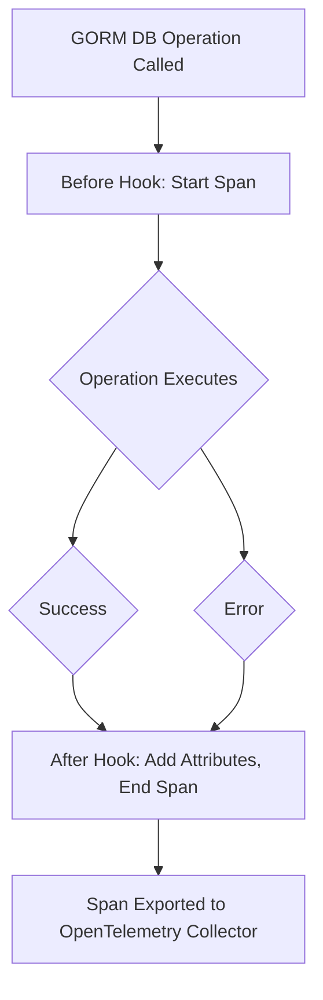

# Integration with GORM & OpenTelemetry

## Unlocking Seamless Observability for Your GORM Database Operations

The GORM OpenTelemetry plugin is designed to integrate effortlessly with GORM's extensible plugin system, providing robust tracing, metrics, and logging capabilities without disrupting your existing workflows. This page walks you through exactly how the plugin hooks into GORM, communicates with OpenTelemetry components, and what you need to know about dependencies and compatibility to get started smoothly.

---

## How the Plugin Integrates with GORM

At its core, the plugin operates by attaching itself as a GORM plugin that registers callback hooks at strategic points across the GORM lifecycle. These hooks intercept database operations and emit OpenTelemetry signals such as traces and metrics.

### Supported Hook Points

The plugin hooks into the following GORM callbacks, meaning it traces and records metrics around these operations by default:

- `Create` (before and after creating records)
- `Query`/`Select` (before and after data retrieval queries)
- `Delete` (before and after record deletion)
- `Update` (before and after updating records)
- `Row` (before and after single row retrieval)
- `Raw` (before and after raw SQL execution)

These hooks are registered on both the "before" and "after" stages of each operation, enabling the plugin to create spans as operations begin and close them as they complete.

### What Happens Inside Each Hook

- **Before hooks** initiate a new OpenTelemetry span with the operation name, e.g., `gorm.Create`.
- The plugin captures critical context such as the database system, SQL query, server address (with sensitive info sanitized), and the affected database table.
- **After hooks** finalize the spans, attaching useful metadata like rows affected, query summary, errors if any, and custom attributes.

This lifecycle ensures every key database action is observably traced with rich detail that is essential for debugging and performance monitoring.

### Using the Plugin

To activate the integration in your project, you simply create a new plugin instance and register it with your GORM database handle:

```go
import "gorm.io/plugin/opentelemetry/tracing"

// Open your GORM DB instance first
db, err := gorm.Open(sqlite.Open("file::memory:?cache=shared"), &gorm.Config{})
if err != nil {
    panic(err)
}

// Use the plugin to enable tracing and metrics
if err := db.Use(tracing.NewPlugin()); err != nil {
    panic(err)
}
```

If you prefer tracing without the metrics collection, use the provided option:

```go
if err := db.Use(tracing.NewPlugin(tracing.WithoutMetrics())); err != nil {
    panic(err)
}
```

This flexibility lets you tailor the integration to your observability needs.

---

## Communication with OpenTelemetry

The plugin leverages the OpenTelemetry Go SDK's tracer provider to generate spans. Key points include:

- It obtains the current tracer from the global OpenTelemetry tracer provider by default, but you can customize it through plugin options.
- Spans are created with kind `SpanKindClient` to indicate client-side database operations.
- Attributes follow OpenTelemetry semantic conventions, covering `db.system`, `db.statement`, `db.operation`, `db.collection` (table), and `server.address`.
- Errors during operations are recorded as span errors with appropriate status codes.

This strict adherence guarantees compatibility with OpenTelemetry backends such as Jaeger, Zipkin, or any compliant tracing system.

---

## Dependencies & Compatibility

### Core Dependencies

- **GORM v2**: The plugin is built as a GORM plugin for version 2.x. It relies on GORM's callback structures and lifecycle.
- **OpenTelemetry Go SDK**: It uses the official OpenTelemetry libraries (`go.opentelemetry.io/otel` and related packages) for tracing and metrics.

### Supported Databases

Due to the use of GORM drivers, the plugin supports any database GORM supports, with specific handling for extracting server addresses from DSN strings for:

- MySQL
- PostgreSQL
- ClickHouse

Less common or custom dialects will silently skip the server address attribute but retain other tracing features.

### Environment Compatibility

- Designed for Go 1.18+.
- Compatible with containerized deployments, demonstrated by the included examples using Docker Compose for Jaeger and Prometheus.

---

## System Requirements & Recommendations

- Ensure your application imports and initializes OpenTelemetry SDK appropriately, including configuring exporters (e.g., Jaeger, Prometheus) as described in the example folders.
- Manage context propagation properly in your application to benefit fully from distributed tracing.
- For capturing detailed query information while respecting privacy, the plugin can be configured to exclude query variable values or server addresses.

<Note>
You must register the OpenTelemetry tracer provider in your application before activating the plugin for accurate and complete metrics and traces.
</Note>

---

## Quick Visual Workflow



This simple flow shows how the plugin fits within your DB operations to create observability signals.

---

## Best Practices & Tips

- **Use with Logging Plugin**: For unified observability, combine with the Logrus hook plugin to link logs to spans.
- **Context Propagation**: Pass context through your GORM calls to link traces end-to-end.
- **Performance Considerations**: Disable metrics if you only require tracing to reduce overhead.
- **Sanitize Sensitive Data**: Utilize the plugin options to exclude sensitive details from query logs.

---

## Summary

By integrating directly into GORM's native plugin and callback system, this plugin brings powerful OpenTelemetry tracing and metrics to your database layer with minimal code changes. It enables proactive monitoring, faster debugging, and deep observability insights.

Explore the full documentation on [core features](/overview/product-intro/core-features), [getting started](/getting-started/introduction-and-prerequisites/product-overview), and [real-world usage examples](/guides/real-world-examples/prometheus-integration) to maximize your observability investment.

---

## Related Links

- [What is GORM OpenTelemetry?](/overview/product-intro/what-is-gorm-otel)
- [Core Features at a Glance](/overview/product-intro/core-features)
- [Instrument GORM Logging with Logrus](/guides/essential-workflows/setup-logging)
- [Enable Tracing and Metrics Collection](/guides/essential-workflows/enable-tracing-metrics)
- [Integrate with Prometheus Monitoring](/guides/real-world-examples/prometheus-integration)
- Example usage with Jaeger and Prometheus in `examples/demo` and `examples/metric` folders

---

## Next Steps

1. Review the [Installation guide](/getting-started/installation-and-configuration/installation) to add the plugin to your project.
2. Follow the [Basic Configuration](/getting-started/installation-and-configuration/basic-configuration) to set exporters and customize behavior.
3. Use [Validation & Troubleshooting](/getting-started/validation-and-troubleshooting/validation-steps) if issues arise.
4. Combine with logging to build comprehensive observability.


---

For hands-on examples and detailed environment configuration, see the demo Docker Compose setups at [examples/demo/docker-compose.yaml](https://github.com/go-gorm/opentelemetry/blob/main/examples/demo/docker-compose.yaml) and [examples/metric/docker-compose.yml](https://github.com/go-gorm/opentelemetry/blob/main/examples/metric/docker-compose.yml).

---

<Source url="https://github.com/go-gorm/opentelemetry" paths={[{"path": "tracing/tracing.go", "range": "1-186"}]} />
