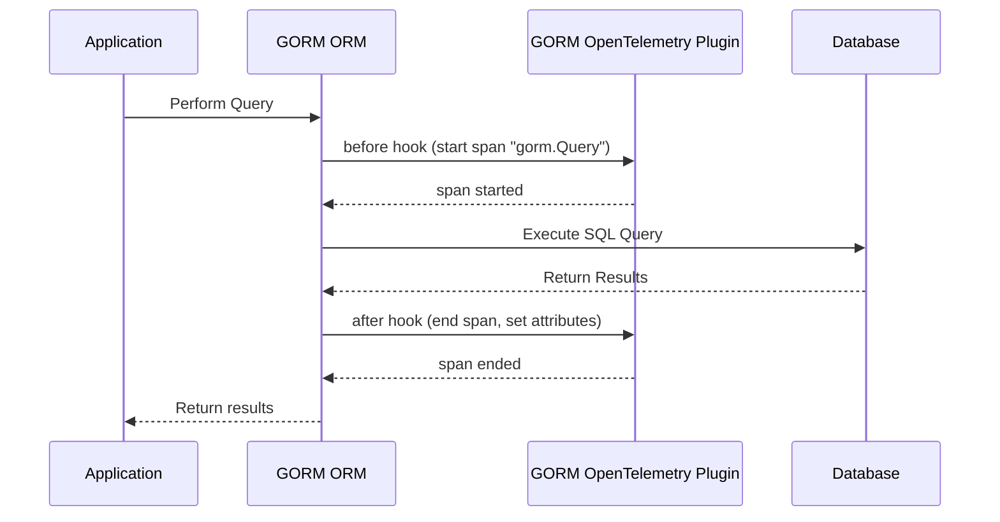

# Key Concepts & Terminology

Understanding the key terms and concepts used throughout GORM OpenTelemetry is critical to effectively implementing and interpreting the observability features integrated into your database operations. This page clarifies essential terminology such as tracing hooks, spans, metrics, providers, logging hooks, and environment-driven configuration. Mastering these concepts empowers you to navigate the documentation and plugin functionality with confidence.

---

## Core Terminology Explained

### 1. Tracing Hooks

**Definition:** Tracing hooks are interception points within GORM’s lifecycle where OpenTelemetry spans are created, allowing observation of database operations.

- These hooks trigger before and after database actions like `Create`, `Query`, `Update`, `Delete`, `Row`, and `Raw` executions.
- A span is started before the operation and ended afterward, capturing timing, attributes, and errors.

**User Story:** Imagine you want to measure how long each SQL query takes and gather contextual details such as the operation type and affected table. Tracing hooks enable this by automatically wrapping your database calls without manual instrumentation.

---

### 2. Spans

**Definition:** A span represents a timed operation within a trace. It records the start and end time, metadata (attributes), and any errors encountered.

- Spans created by the plugin typically represent individual database operations.
- They include semantic attributes like `db.system`, `db.operation`, `db.statement`, `db.rows_affected`, and `server.address` describing the database type, SQL command, query text, affected rows, and server location.

**Benefit:** Spans help you drill down into each query’s behavior, identify performance bottlenecks, and trace transaction flow across services.

---

### 3. Metrics

**Definition:** Metrics provide numeric measurements about your database usage and health over time.

- The plugin collects metrics such as connection pool statistics (max idle connections, open connections) and operational data like rows affected.
- These metrics integrate with systems like Prometheus to enable alerts and dashboards.

**Usage Scenario:** Metrics complement tracing by providing aggregated visibility — for example, monitoring changes in average query latency or connection saturation.

---

### 4. Providers

**Definition:** Providers are OpenTelemetry components responsible for managing and exporting telemetry data.

- GORM OpenTelemetry uses a `TracerProvider` to create tracers that generate spans.
- The plugin supports an out-of-the-box default provider but also allows custom providers via options.

**Why It Matters:** Choosing or configuring the right provider controls how and where your telemetry data is sent, such as to Jaeger for tracing or Prometheus for metrics.

---

### 5. Logging Hooks

**Definition:** Logging hooks extend GORM’s logging by integrating with OpenTelemetry to enrich logs with trace context.

- The plugin supports replacing GORM’s default logger with a `logrus`-based logger.
- This integration allows logs to include span information, facilitating correlation between logs and traces.

**Practical Benefit:** This unified approach enables smoother troubleshooting where logs and traces tell a connected story of database interactions.

---

### 6. Environment-Driven Configuration

**Definition:** The plugin behavior can be customized dynamically via environment variables.

- Environment variables can control aspects such as which exporter to use, whether to enable metrics or traces, and the verbosity of logs.
- This makes the setup flexible and adaptable across development, staging, and production environments without code changes.

**Best Practice:** Use environment variables to tweak observability levels on the fly during deployments or incident investigations.

---

## How These Concepts Work Together

When you enable the GORM OpenTelemetry plugin, it registers hooks into the GORM lifecycle for operations such as `Create`, `Query`, and `Update`. At each hook:

1. **Before the operation:** A new span starts, capturing the operation type, the database system (MySQL, Postgres, etc.), and server address.
2. **During the operation:** The actual SQL query is executed as usual.
3. **After the operation:** The span records details—including the formatted query, rows affected, and any errors encountered—then closes.

Meanwhile, metrics about the database connection pool and operation counts are continuously gathered and available for external scraping.

Logs are enhanced via the logging hook to include trace context, enabling you to easily correlate events across logs, traces, and metrics.

---

## Practical Tips & Common Pitfalls

- **Span Naming:** The plugin sets span names based on operation summaries (e.g., "SELECT users") to make trace views immediately meaningful.
- **Sensitive Data:** By default, query variables are included in spans for richer context but can be excluded via configuration to avoid exposing sensitive information.
- **Server Address Extraction:** The plugin intelligently extracts `server.address` from diverse DSN formats to accurately tag spans.
- **Performance Impact:** Enabling full metrics, tracing, and logging can impact performance; start with tracing alone and add metrics or logs as needed.
- **Error Recording:** Spans will record database errors, but errors like "record not found" are handled gracefully and do not mark spans as errors.

---

## Illustrative Example: Tracing Lifecycle

---

## Summary

Understanding these key concepts — tracing hooks, spans, metrics, providers, logging hooks, and environment configuration — is essential to realizing the full benefits of GORM OpenTelemetry. They empower you to monitor, troubleshoot, and observe your database interactions with precision.

---

## Next Steps

- Dive into the [High-Level Architecture](/overview/architecture-and-concepts/high-level-architecture) page to see how these concepts map onto the system’s design.
- Explore the [Installation](/getting-started/installation-and-configuration/installation) page to begin integrating telemetry with GORM.
- Review [Target Audience & Use Cases](/overview/product-intro/target-audience-use-cases) to understand practical implementations.

---

<Callout title="Explore More">
Ensure you review the [Integration with GORM & OpenTelemetry](/overview/architecture-and-concepts/integration-points) page for detailed integration workflows and options.
</Callout>
